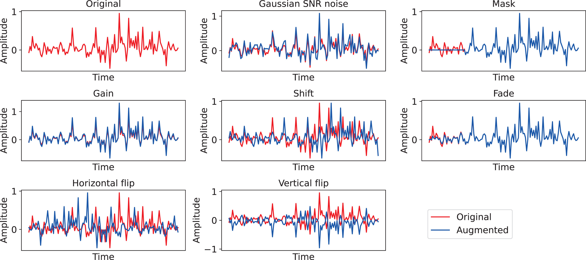
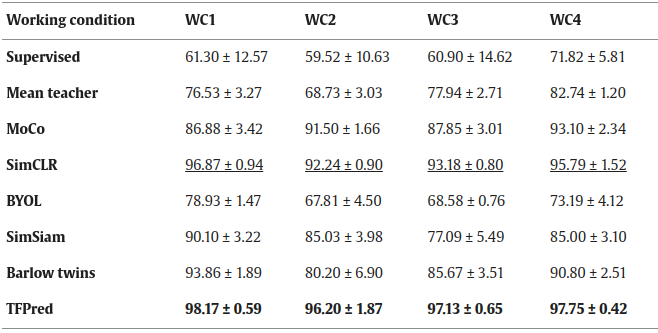
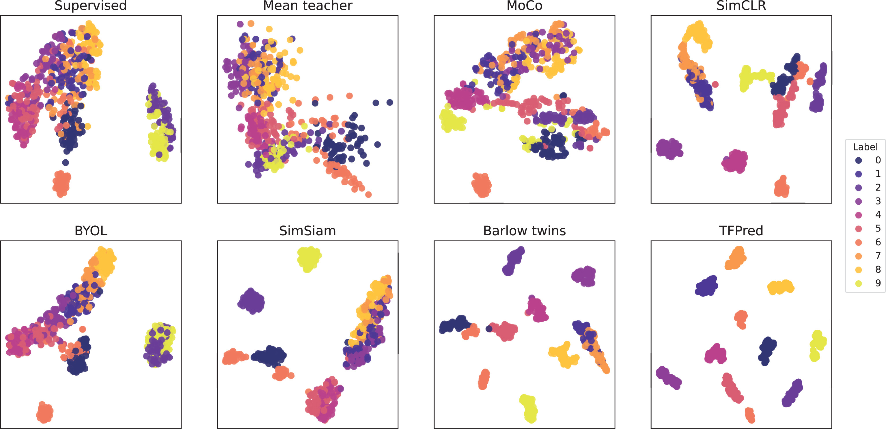

## TFPred: Learning Discriminative Representations from Unlabeled Data for Few-Label Rotating Machinery Fault Diagnosis

An official implementation of paper: [TFPred: Learning Discriminative Representations from Unlabeled Data for Few-Label Rotating Machinery Fault Diagnosis](https://www.sciencedirect.com/science/article/pii/S0967066124000601). The **pre-trained feature encoders are also provided in the folder './History'**, feel free to use them in your program.

```tex
@article{CHEN2024105900,
title = {TFPred: Learning discriminative representations from unlabeled data for few-label rotating machinery fault diagnosis},
journal = {Control Engineering Practice},
volume = {146},
pages = {105900},
year = {2024},
issn = {0967-0661},
author = {Xiaohan Chen and Rui Yang and Yihao Xue and Baoye Song and Zidong Wang}
}
```

### 1. Requirements
- python 3.9.12
- numpy 1.23.1
- torch 1.13.1
- torchvision 0.14.1
- torchaudio 0.13.1
- tqdm 4.64.0
- scipy 1.8.1

### 2. Dataset:

Run-to-failure bearing fault dataset:
> Lessmeier, C., Kimotho, J. K., Zimmer, D., & Sextro, W. (2016). Condition monitoring of bearing damage in electromechanical drive systems by using motor current signals of electric motors: A benchmark data set for data-driven classification. Vol. 3, In PHM Society European Conference.

### 3. Usage:

Please replace the `datadir` with your dataset path.

```bash
python TFPred.py \
    --datadir "dataset path"
    --mode "train_then_tune" \
    --load 3 \
    --num_train 210 \
    --num_validation 30 \
    --num_test 60 \
    --num_labels 3 \
    --data_length 1024 \
    --window 512 \
    --max_epochs 500 \
    --batch_size 256 \
    --lr 1e-2 \
    --normalization '0-1' \
    --tune_max_epochs 100 \
    --backbone_lr 5e-3 \
    --classifier_lr 5e-3 \
```

### 4. Experiments

#### 4.1 Augmentation visualizations


#### 4.2 Results on run-to-failure bearing dataset


#### 4.3Feature visualizations
